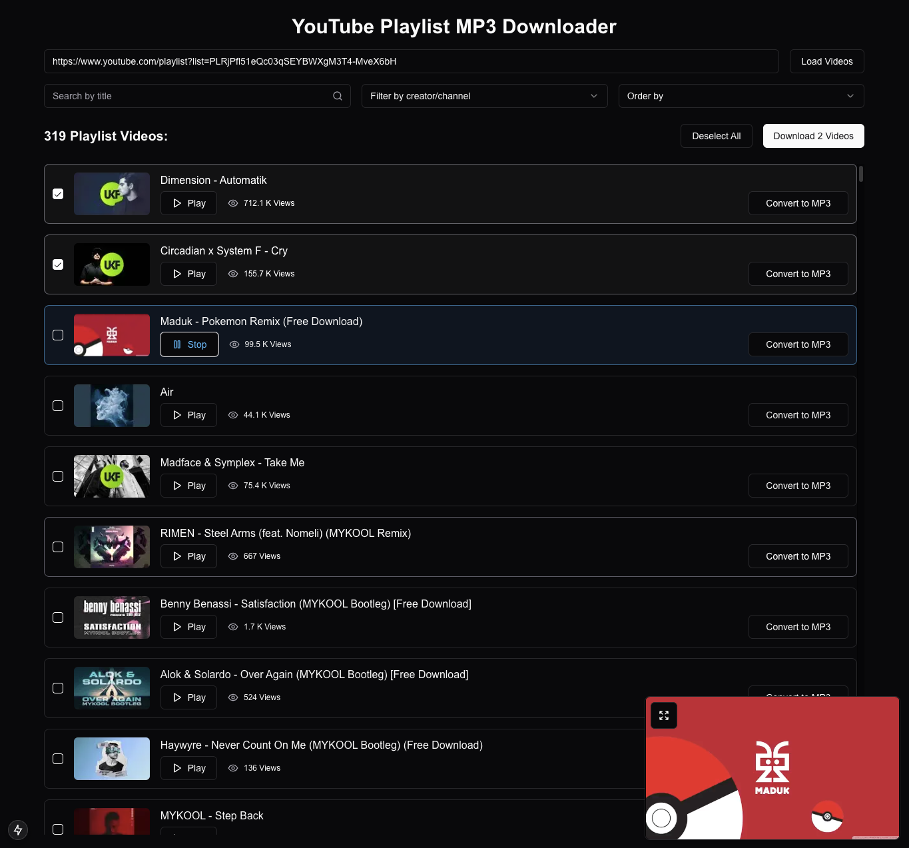

# 🎶 YouTube Playlist MP3 Downloader 🎵

This web application lets you effortlessly download audio tracks from YouTube playlists as MP3 files. With a user-friendly interface, you can search, filter, and manage videos, supporting both batch processing and individual downloads. 🚀



## 📋 Table of Contents
- [Setup](#️-setup)
- [Features](#-features)
- [How It Works](#-how-it-works)
- [Tech Stack](#️-tech-stack)
- [Future Improvements](#-future-improvements)
- [System Requirements](#-system-requirements)
- [Troubleshooting](#-troubleshooting)
- [License](#-license)

---

## 🛠️ Setup

### Prerequisites

- 🖥️ Node.js 18+ and pnpm (or npm/yarn) installed
- 🐍 Python 3.7+ installed (for the backend download server)
- 🎵 FFmpeg installed and available in your PATH

### Installation

1. Clone the repository:
  ```bash
  git clone https://github.com/yourusername/youtube-playlist-to-mp3.git
  cd youtube-playlist-to-mp3
  ```

2. Install frontend dependencies:
  ```bash
  pnpm install
  ```

3. Install backend dependencies:
  ```bash
  # Make sure you are using the correct Python environment if you use tools like venv or conda
  pip install -r requirements.txt
  ```

### Environment Variables

Configure a `.env.local` file in the project root.
Add your YouTube Data API v3 key:
```
YOUTUBE_API_KEY=your_youtube_api_key_here
```
You can get an API key from the Google Cloud Console by enabling the "YouTube Data API v3".

### Running Locally

This project uses a Next.js frontend and a separate Flask backend for handling downloads. You need to run both servers concurrently for local development.

#### Using the integrated script (Recommended):

Run the following command in your terminal. It uses concurrently (installed as a dev dependency) to start both servers:
```bash
pnpm dev
```

This will:
- Start the Next.js development server (usually on http://localhost:3000)
- Start the Flask backend server (usually on http://localhost:5328)
- Logs from both servers will be shown in the same terminal.

#### Running servers separately (Alternative):

If you prefer, you can run them in separate terminals:

1. Terminal 1 (Flask Backend):
  ```bash
  # Make sure your Python environment is active if needed (e.g., source .venv/bin/activate)
  python backend/app.py
  ```

2. Terminal 2 (Next.js Frontend):
  ```bash
  pnpm dev:next
  ```

Your application should now be running, typically at http://localhost:3000.

## 🌟 Features

### 📋 Playlist Loading
- **Load YouTube Playlist**: Enter a YouTube playlist URL to fetch and display all videos in the playlist.
- **Dynamic Filters**:
  - 🔍 Filter videos by title using a search bar.
  - 🎥 Filter by creator/channel.
  - 🔢 Sort videos by views or title.

### 📂 Video Management
- **Select Videos**:
  - ✅ Select individual videos or use the "Select All" button to batch-select videos.
  - ❌ Deselect videos individually or use the "Deselect All" button.
- **Video Cards**:
  - 🎞️ Display each video with its thumbnail, title, views, and creator details.
  - ▶️ Play or ⏹️ stop a video using the embedded YouTube player.
  - 🎵 Convert and download videos individually with easy-to-use buttons.

### 🔄 MP3 Conversion
- **Batch Processing**:
  - 🎛️ Select multiple videos and convert them to MP3 format.
  - 📈 Track progress for each video during downloading and conversion.
  - 📦 Download all converted MP3 files as a ZIP archive.
- **Individual Downloads**:
  - 🛠️ Convert and download single MP3 files with real-time progress tracking.
  - ⚡ High-quality 320kbps MP3 files.
- **Special Character Support**:
  - 🌐 Full support for international characters, including Vietnamese.
  - 🔤 Automatic filename sanitization.

### 🖥️ UI and Usability
- **Progress Tracking**:
  - 📊 See real-time progress for individual and batch downloads with a fill-up bar and percentage updates.
- **Floating Video Player**:
  - 🎥 Preview any video in a floating, resizable player.
- **Responsive Design**:
  - 📱 Optimized for both desktop and mobile devices.

## 💡 How It Works

1. **Load Playlist**:
  - Paste a YouTube playlist URL.
  - The app fetches playlist details via the YouTube API and displays the videos.

2. **Select Videos**:
  - Use filters to refine your selection.
  - ✅ Select videos for conversion and downloading.

3. **Convert and Download**:
  - **Individual Downloads**:
    - Click "Download MP3" on a video card.
    - The server fetches the video, converts it to MP3 using yt-dlp and FFmpeg.
  - **Batch Downloads**:
    - Select multiple videos and click "Download Selected".
    - All selected videos are processed and packaged as a ZIP file.

4. **Monitor Progress**:
  - Watch real-time progress updates for each video during the download and conversion.

## ⚙️ Tech Stack

### Frontend:
- 🌐 Next.js (App Router)
- 💻 TypeScript for type safety
- 🎨 TailwindCSS for styling
- 🧩 shadcn/ui components for prebuilt, customizable UI components

### State Management:
- 🗂️ Zustand for managing global state (e.g., progress tracking)

### Media Processing:
- 🔧 Server-side processing with yt-dlp and FFmpeg
- 📦 JSZip for client-side ZIP file creation

### Backend:
- 🔙 Flask backend for handling video downloads and conversion
- 🎵 High-quality MP3 conversion at 320kbps

## 🚀 Future Improvements
- 📜 Add pagination for large playlists
- ⚡ Add support for various audio formats and quality options
- 🛡️ Enhance error handling for failed conversions or downloads
- 🔑 Add user authentication for personalized features
- 📱 Implement a fully responsive mobile interface
- 🔄 Add automatic playlist synchronization feature
- 💾 Implement download history and favorites system
- 🔊 Add audio visualization during playback
- 👥 Share playlists with other users

## 📋 System Requirements

### Client
- Modern web browser with JavaScript enabled
- Internet connection for streaming and downloading

### Server
- Node.js 18+ for the frontend
- Python 3.7+ for the backend
- FFmpeg installed and available in system PATH
- 100MB+ free disk space for temporary file processing
- Internet connection for accessing YouTube API

## 🔧 Troubleshooting

### Downloads failing?
- Ensure FFmpeg is correctly installed and accessible in your PATH
- Check if you're using the latest version of yt-dlp
- Verify YouTube isn't limiting your requests (try with VPN)

### High server load?
- Adjust the MAX_CONCURRENT_CONVERSIONS setting in the code
- Consider using a more powerful server for heavy batch processing

## 📜 License
This project is licensed under the MIT License.  
Copyright © 2025 Nguyen Duc Manh

Enjoy using the YouTube Playlist MP3 Downloader! 🎧
